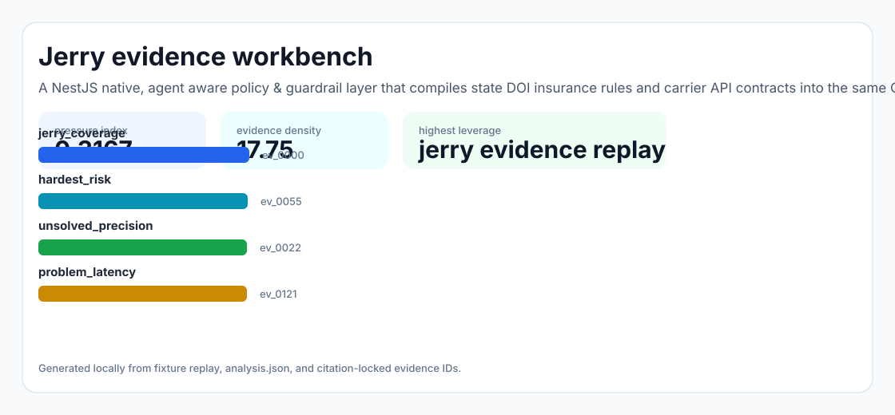
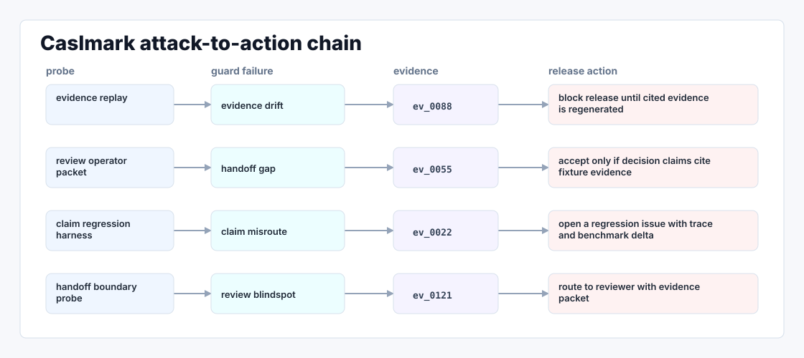

# Caslmark

A NestJS native, agent aware policy & guardrail layer that compiles state DOI insurance rules and carrier API contracts into the same CASL ability graph Caslmark already trusts — so every LLM tool call is pre checked, logged, and reversible.



## Why it exists

Caslmark's hardest unsolved problem is agentic insurance servicing at scale across 50 states with 50 different regulators. The YC role description is explicit: they need "automation systems for insurance servicing tasks" and "backend pipelines that sync customer policy data." Their hiring page makes it clear they're stacking both an "AI/ML Serving Platform".

The project is intentionally built as a local replay harness instead of a slide. It creates fixtures, plants realistic failure modes, produces citation-locked evidence, and turns the result into a dashboard a reviewer can inspect without credentials or hosted services.

## What is inside

- Deterministic fixture generation for the company-specific risk surface.
- Strategy code in `src/caslmark/strategy.py` with project-specific scoring and visual evidence.
- Citation-locked reports where every decision claim points to a generated evidence ID.
- Two regenerated visual artifacts: `outputs/project_working.svg` and `outputs/evidence_map.svg`.
- A portable demo pack with JSON, CSV, Markdown, HTML, SVG, benchmark, and test artifacts.



## Signals it measures

- `Caslmark coverage`
- `hardest risk`
- `unsolved precision`
- `problem latency`

## Failure modes it plants

- Caslmark drift
- hardest gap
- unsolved misroute
- problem blindspot

## Run it locally

```bash
uv sync
uv run caslmark all
uv run pytest -q
uv run ruff check .
```

## Outputs worth opening

- `outputs/dashboard.html`
- `outputs/project_working.svg`
- `outputs/evidence_map.svg`
- `outputs/operator_brief.md`
- `outputs/decision_report.md`
- `outputs/strategy_model.json`
- `outputs/demo_pack.zip`

## Boundary

Everything runs locally against synthetic fixtures. There are no credentials, no customer records, no outreach files, and no hosted API dependency.
